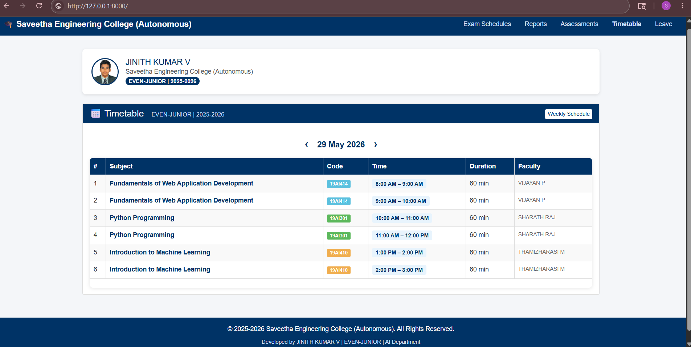

# Ex08 CAMU Schedule using Bootstrap
## Date: 30-05-2026

## AIM:
To design a responsive and visually appealing CAMU Schedule using Bootstrap.

## DESIGN STEPS:
### Step 1:
Clone the repository from GitHub.

### Step 2:
Create Django Admin project.

### Step 3:
Create a New App under the Django Admin project.

### Step 4:
Add the Bootstrap CDN link inside the <head> section.

### Step 5:
Insert a table element with Bootstrap table classes.

### Step 6:
Construct the complete table.

### Step 7:
Add a header/footer displaying copyright information.

### Step 8:
Publish the website in the LocalHost.

## PROGRAM :
```html
index.html
<!DOCTYPE html>
<html lang="en">
<head>
    <meta charset="UTF-8">
    <meta name="viewport" content="width=device-width, initial-scale=1">
    <title>CAMU Schedule</title>

    <link rel="stylesheet"
          href="https://maxcdn.bootstrapcdn.com/bootstrap/3.4.1/css/bootstrap.min.css">

    <style>
        body { background-color: #f4f6f9; }
        .navbar-custom { background-color: #003366; }
        .navbar-custom .navbar-brand,
        .navbar-custom .navbar-nav > li > a { color: #fff; }
        .table-header { background-color: #003366; color: white; }
        .badge-subject { background-color: #17a2b8; }
        footer { background-color: #003366; color: white;
                 text-align: center; padding: 15px; margin-top: 30px; }
    </style>
</head>
<body>

    <script src="https://ajax.googleapis.com/ajax/libs/jquery/3.7.1/jquery.min.js"></script>
    <script src="https://maxcdn.bootstrapcdn.com/bootstrap/3.4.1/js/bootstrap.min.js"></script>
</body>
</html>

timetable.html
<!DOCTYPE html>
<html lang="en">
<head>
    <meta charset="UTF-8">
    <meta name="viewport" content="width=device-width, initial-scale=1">
    <title>CAMU Schedule - Saveetha Engineering College</title>

    <link rel="stylesheet"
          href="https://maxcdn.bootstrapcdn.com/bootstrap/3.4.1/css/bootstrap.min.css">

    <style>
        body { background-color: #f4f6f9; font-family: Arial, sans-serif; }

        .navbar-custom { background-color: #003366; border: none; border-radius: 0; }
        .navbar-custom .navbar-brand { color: #fff; font-weight: bold; font-size: 18px; }
        .navbar-custom .navbar-nav > li > a { color: #cce0ff; }
        .navbar-custom .navbar-nav > li > a:hover { color: #fff; background-color: #002244; }

        .profile-card {
            background: white;
            border-radius: 8px;
            padding: 20px;
            margin-bottom: 20px;
            box-shadow: 0 2px 6px rgba(0,0,0,0.1);
            display: flex;
            align-items: center;
            gap: 15px;
        }
        .profile-card img {
            border-radius: 50%;
            width: 60px; height: 60px;
            object-fit: cover;
            border: 3px solid #003366;
        }

        .date-nav {
            text-align: center;
            margin: 15px 0;
            font-size: 18px;
            font-weight: bold;
            color: #003366;
        }
        .date-nav a { color: #003366; text-decoration: none; margin: 0 15px; font-size: 22px; }
        .date-nav a:hover { color: #0066cc; }

        .table-schedule {
            background: white;
            border-radius: 8px;
            overflow: hidden;
            box-shadow: 0 2px 8px rgba(0,0,0,0.1);
        }
        .table-schedule thead tr { background-color: #003366; color: white; }
        .table-schedule tbody tr:hover { background-color: #e8f0fe; }

        .subject-name { font-weight: bold; color: #003366; }
        .time-badge {
            display: inline-block;
            background-color: #e8f4fd;
            color: #003366;
            border-radius: 4px;
            padding: 2px 8px;
            font-size: 12px;
            font-weight: bold;
        }
        .faculty-tag {
            font-size: 12px;
            color: #666;
        }

        footer {
            background-color: #003366;
            color: white;
            text-align: center;
            padding: 15px;
            margin-top: 30px;
        }
    </style>
</head>
<body>

<nav class="navbar navbar-custom">
    <div class="container-fluid">
        <div class="navbar-header">
            <button type="button" class="navbar-toggle collapsed"
                    data-toggle="collapse" data-target="#navMenu">
                <span class="icon-bar"></span>
                <span class="icon-bar"></span>
                <span class="icon-bar"></span>
            </button>
            <a class="navbar-brand" href="#">
                🎓 Saveetha Engineering College (Autonomous)
            </a>
        </div>
        <div class="collapse navbar-collapse" id="navMenu">
            <ul class="nav navbar-nav navbar-right">
                <li><a href="#">Exam Schedules</a></li>
                <li><a href="#">Reports</a></li>
                <li><a href="#">Assessments</a></li>
                <li><a href="#" class="active"><strong>Timetable</strong></a></li>
                <li><a href="#">Leave</a></li>
            </ul>
        </div>
    </div>
</nav>

<div class="container" style="margin-top: 30px;">

    <div class="profile-card">
        
        <div>
            <h4 style="margin:0; color:#003366;">JINITH KUMAR V</h4>
            <p style="margin:0; color:#555;">Saveetha Engineering College (Autonomous)</p>
            <span class="badge" style="background:#003366;">EVEN-JUNIOR | 2025-2026</span>
        </div>
    </div>

    <div class="panel panel-default">
        <div class="panel-heading" style="background:#003366; color:white;">
            <h3 class="panel-title" style="font-size:20px;">
                📅 Timetable &nbsp;
                <small style="color:#cce0ff;">EVEN-JUNIOR | 2025-2026</small>
                <span class="pull-right">
                    <a href="#" class="btn btn-xs btn-light"
                       style="background:white; color:#003366;">Weekly Schedule</a>
                </span>
            </h3>
        </div>

        <div class="panel-body">
            <div class="date-nav">
                <a href="#">&#8249;</a>
                29 May 2026
                <a href="#">&#8250;</a>
            </div>

            <div class="table-responsive table-schedule">
                <table class="table table-bordered table-hover table-striped">
                    <thead>
                        <tr>
                            <th>#</th>
                            <th>Subject</th>
                            <th>Code</th>
                            <th>Time</th>
                            <th>Duration</th>
                            <th>Faculty</th>
                        </tr>
                    </thead>
                    <tbody>
                        <tr>
                            <td>1</td>
                            <td class="subject-name">Fundamentals of Web Application Development</td>
                            <td><span class="label label-info">19AI414</span></td>
                            <td><span class="time-badge">8:00 AM – 9:00 AM</span></td>
                            <td>60 min</td>
                            <td class="faculty-tag">VIJAYAN P</td>
                        </tr>
                        <tr>
                            <td>2</td>
                            <td class="subject-name">Fundamentals of Web Application Development</td>
                            <td><span class="label label-info">19AI414</span></td>
                            <td><span class="time-badge">9:00 AM – 10:00 AM</span></td>
                            <td>60 min</td>
                            <td class="faculty-tag">VIJAYAN P</td>
                        </tr>
                        <tr>
                            <td>3</td>
                            <td class="subject-name">Python Programming</td>
                            <td><span class="label label-success">19AI301</span></td>
                            <td><span class="time-badge">10:00 AM – 11:00 AM</span></td>
                            <td>60 min</td>
                            <td class="faculty-tag">SHARATH RAJ</td>
                        </tr>
                        <tr>
                            <td>4</td>
                            <td class="subject-name">Python Programming</td>
                            <td><span class="label label-success">19AI301</span></td>
                            <td><span class="time-badge">11:00 AM – 12:00 PM</span></td>
                            <td>60 min</td>
                            <td class="faculty-tag">SHARATH RAJ</td>
                        </tr>
                        <tr>
                            <td>5</td>
                            <td class="subject-name">Introduction to Machine Learning</td>
                            <td><span class="label label-warning">19AI410</span></td>
                            <td><span class="time-badge">1:00 PM – 2:00 PM</span></td>
                            <td>60 min</td>
                            <td class="faculty-tag">THAMIZHARASI M</td>
                        </tr>
                        <tr>
                            <td>6</td>
                            <td class="subject-name">Introduction to Machine Learning</td>
                            <td><span class="label label-warning">19AI410</span></td>
                            <td><span class="time-badge">2:00 PM – 3:00 PM</span></td>
                            <td>60 min</td>
                            <td class="faculty-tag">THAMIZHARASI M</td>
                        </tr>
                    </tbody>
                </table>
            </div>

        </div>
    </div>
</div>

<footer>
    <p>&copy; 2025-2026 Saveetha Engineering College (Autonomous). All Rights Reserved.</p>
    <p style="font-size:12px; color:#cce0ff;">
        Developed by JINITH KUMAR V | EVEN-JUNIOR | AI Department
    </p>
</footer>

<script src="https://ajax.googleapis.com/ajax/libs/jquery/3.7.1/jquery.min.js"></script>
<script src="https://maxcdn.bootstrapcdn.com/bootstrap/3.4.1/js/bootstrap.min.js"></script>

</body>
</html>

DEVELOPED BY: JINITH KUMAR V
REGISTER NO: 212225040157
```

## OUTPUT:


## RESULT:
A responsive and visually appealing CAMU Schedule web page using Bootstrap is designed successfully.
